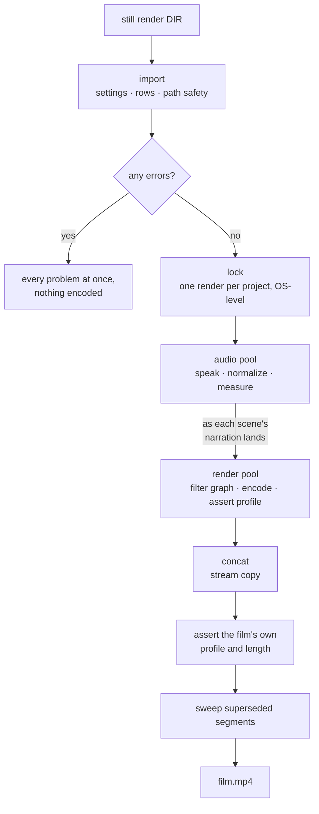
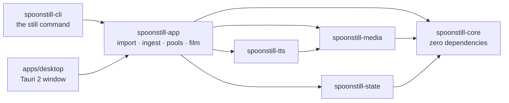

<div align="center">


# spoonstill

**Turn a folder of photos and narration into one finished MP4.**

Ken Burns motion on every still, cut on the narration's own boundaries.
Drop in your files, press Render, walk away.

[](https://github.com/VijaysinghPuwar/spoonstill/actions/workflows/ci.yml)
[](https://github.com/VijaysinghPuwar/spoonstill/releases/latest)
[](#install)
[](rust-toolchain.toml)
[](Cargo.toml)

<br>


<sub>Four scenes, 15 seconds, rendered by `still render --subtitles boxed`.
Narration spoken by a neural voice from the text beside each photo; the motion,
the cuts and the captions are all the renderer's. Rebuild it with `make demo`.</sub>

</div>

---

## Contents

**Using it** — [What it is](#what-it-is) · [Install](#install) · [Quickstart](#quickstart) ·
[The user guide](#the-user-guide) · [Command reference](#command-reference) ·
[Configuration reference](#configuration-reference) · [Troubleshooting](#troubleshooting)

**Reading it** — [How it works](#how-it-works) · [Engineering notes](#engineering-notes) ·
[Project status](#project-status) · [Build from source](#build-from-source) ·
[The documents](#the-documents) · [Licence](#licence)

---

## What it is

You have 40 photographs and something to say over each one. spoonstill pairs
them up, gives each still a slow zoom or pan, makes each scene **exactly as
long as its narration**, and joins the lot into one MP4.

Narration can be a recording you made, a line of text spoken by a neural voice,
or nothing at all — the still just holds for a few seconds. You can mix all
three in one film.

It is **a batch renderer, not a video editor**. There is no timeline and no
scrubber, on purpose. The unit of work is a folder, and the design point is
**500 scenes, not five** — every choice in here was evaluated at that size.

|  | |
|---|---|
| **Good for** | narrated photo essays, chapter-by-chapter audiobooks with artwork, lecture slides with a voiceover, product walkthroughs, Shorts/Reels cut from a photo set, anything where the picture holds still and the voice carries it |
| **Not for** | editing video clips, trimming footage, transitions and effects, anything with a moving source. spoonstill's input is a **still image**. |

Two ways to drive it, and they are the same program:

- **`still`** — the command line. It is the permanent, complete control
  surface: *if the CLI cannot do it, it does not exist.*
- **spoonstill** — a desktop window (macOS and Windows). Three screens — make
  or open a project, fill it, review and render. It owns no logic of its own;
  every button is one of the commands below.

---

## Install

### 1. Get spoonstill

Grab the build for your machine from the
**[latest release](https://github.com/VijaysinghPuwar/spoonstill/releases/latest)**:

| Your machine | Desktop app | Command line |
|---|---|---|
| **macOS** — Apple Silicon *or* Intel | `spoonstill-macOS.dmg` | `still-macOS-AppleSilicon.tar.gz`<br>`still-macOS-Intel.tar.gz` |
| **Windows 10/11, 64-bit** | `spoonstill-Windows-Installer.exe` | `still-Windows.zip` |

The Mac app is one universal build, so you do not have to know which processor
you have. The one-line installer works that out for the command line too:

**macOS**

```bash
curl -fsSL https://raw.githubusercontent.com/VijaysinghPuwar/spoonstill/master/scripts/install.sh | bash
```

**Windows** (PowerShell)

```powershell
irm https://raw.githubusercontent.com/VijaysinghPuwar/spoonstill/master/scripts/install.ps1 | iex
```

Either script **verifies the SHA-256 checksum before it installs**, puts the
`still` command on your PATH, installs the window, and then offers to fetch
FFmpeg through Homebrew or winget if it is missing. Nothing runs as
administrator and nothing is written outside your own user folder. On macOS the
installer also clears the quarantine attribute itself, so the app just opens
(see [unsigned builds](#unsigned-builds) below for why that matters).

### 2. One thing to install first

spoonstill does the thinking; **FFmpeg** does the pixels. It is not bundled yet
(see [D-062](decisions.md) — a shipped binary needs its own LGPL build first),
so it has to be on your machine.

**You do not have to do this by hand.** In the window, go to **Settings** and
press **Install it for me** under *Video engine* — and under *Voice service*
too, if you want written lines read aloud.

From a terminal, one command checks everything and offers to fetch what is
missing:

```bash
still doctor              # what is here, what is not
still doctor --install    # fetch whatever is missing
```

```
  ok       ffmpeg — turning your photos into video
           9.0.1
  ok       edge — reading your written lines aloud

  graphics — hardware encoders this machine can run
    usable               Apple (VideoToolbox) (h264_videotoolbox)
    Films render on the CPU with libx264 (D-036). The encoder is at most a
    fifth of a 4K render, so hardware would not make one much faster (D-159).
```

Or install them yourself, once:

```bash
brew install ffmpeg          # macOS
winget install Gyan.FFmpeg   # Windows

still voices --install       # a neural voice, or: pipx install edge-tts
```

Skip the voice if you are only using recordings you made yourself.

> **A note on voice quality.** Edge TTS is Microsoft's free endpoint and it
> returns 24 kHz mono 48 kbps MP3 — that format is fixed inside `edge-tts`
> itself, because its word-timing arithmetic divides by exactly that bitrate.
> spoonstill does not degrade it further (the working artifact is lossless PCM
> and the film's audio is 192 kbps AAC), but a free service's ceiling is a free
> service's ceiling. A higher-fidelity provider is on the roadmap.

### If you are on Windows, please read this

Windows is a supported target and it is not an afterthought. Every push runs the
full suite on a Windows runner — formatting, clippy with warnings denied, and
`cargo test --workspace`, which renders real media through real FFmpeg — the
installer is executed end to end on a Windows runner on every push, and the code
is additionally cross-compiled for `x86_64-pc-windows-msvc` before a tag is cut
([D-132](decisions.md)). A session has now been run on real Windows hardware:
`ffmpeg-findings.md` §13 is the first set of numbers in this project that is not
macOS.

The **39 `make gates` checks now run on Windows too** ([D-176](decisions.md)):
M2 is 23/23 there under Git Bash. One M1 gate is the exception and says so when
it skips — cancellation is a console event on Windows and the harness has no way
to send one, so that assertion stays macOS's. If you are the first person to hit something,
an [issue](https://github.com/VijaysinghPuwar/spoonstill/issues) with
`still doctor` output is genuinely useful.

### Unsigned builds

These builds are **not code-signed yet** — signing certificates are M5 work. The
operating system is telling you it cannot identify the publisher, which is true,
and not that anything is wrong with the file.

**The one-line installer above avoids this entirely.** If you downloaded the
`.dmg` or `.exe` through a browser instead:

- **macOS** — press **Done** on that dialog, never *Move to Trash*. Then either
  **System Settings › Privacy & Security**, scroll down, **Open Anyway** — or,
  once:
  ```bash
  xattr -dr com.apple.quarantine /Applications/spoonstill.app
  ```
  Right-click › Open is the advice everywhere on the internet and **Apple
  removed it in macOS 15**; on 15 or later it does nothing.
- **Windows** — on the SmartScreen dialog, click **More info** › **Run anyway**.

If that trade is not one you want to make, [build from
source](#build-from-source) instead: it is two commands.

---

## Quickstart

```bash
# 1. Make a project out of whatever you have. Nothing gets renamed or moved.
still new ~/holiday ~/Pictures/trip/*.jpg ~/Voice\ Memos/*.m4a

# 2. See what it made of them, before anything is encoded.
still validate ~/holiday

# 3. Render.
still render ~/holiday --out ~/holiday.mp4
```

`still new` copies your photos in as `001`, `002`, … in natural order and pairs
each one with a recording — **by matching name first, then by position**. It
never touches your originals, never overwrites anything, and never renames a
file you did not give it.

Prefer the window? Launch **spoonstill**, choose a folder, drop your files on it,
and press Render.

That is the whole loop. Everything below is detail you can reach for when you
need it.

---

## The user guide

### How a project folder works

A project is just a folder. Everything in it is optional, including
`project.yaml` — **a folder of images is already a valid project**.

```
holiday/
├── project.yaml     ← settings. Never scenes. spoonstill never writes to it.
├── scenes.csv       ← optional. When present, it is the complete scene list.
├── img/
│   ├── 001.jpg
│   └── 002.jpg
├── audio/
│   ├── 001.m4a      ← paired to 001.jpg by name
│   └── 002.txt      ← a line to be spoken over 002.jpg
├── removed/         ← scenes you took out. Nothing here is ever deleted.
└── .spoonstill/     ← cache, logs, render lock. Holds no authority — delete it any time.
```

**How files become scenes.** A scene is every file sharing a numeric stem, so
the numbers *are* the running order. `still new` and `still add` do the
numbering for you; you can also number things yourself. Pairing is by **stem
first, then by position** — so `beach.jpg` + `beach.m4a` pair by name whatever
order you list them in, and unnamed leftovers are paired in natural sort order.

**What it accepts:**

| | Extensions |
|---|---|
| **Stills** | `jpg` `jpeg` `png` `webp` `tif` `tiff` `bmp` `heic` |
| **Recordings** | `mp3` `m4a` `wav` `aac` `flac` `ogg` `opus` `wma` |
| **Written lines** | `txt` — and `md`, but only when its name matches a still |

Extensions are a *hint*, never evidence: every file is probed with `ffprobe`
before a render, so a truncated JPEG or a zero-byte MP3 is caught by
`still validate` rather than four minutes into an encode.

> A `.md` in a folder of photographs is overwhelmingly a `README`, and the one
> thing worse than not speaking it is speaking it — so a `.md` is read only when
> its name matches a still, never guessed into position ([D-152](decisions.md)).

### Narration: recordings, written lines, or silence

Each scene gets **exactly one** source of audio. In a folder, spoonstill works
out which file is doing which job; where that is genuinely ambiguous — two
recordings for one still, or a manifest row declaring two — it says so and stops
rather than guessing:

| What you put beside the photo | What happens |
|---|---|
| A recording (`001.m4a`) | It is the narration. The scene is exactly as long as it. |
| A line of text (`001.txt`) | A neural voice reads it. The scene is as long as the speech. |
| Both | The **recording** is the narration and the **text becomes the caption** for it — so your own voiceover can be subtitled without typing anything twice. |
| Nothing | The still holds for `defaults.duration` seconds (4.0 by default), in silence. |

**Length always comes from the audio**, measured with `ffprobe` on the
normalized file — never estimated from the text, never trusted from a container
header. That is why a 500-scene film lands within one frame of its expected
length across 500 joins.

**Everything is levelled to the same loudness** — −16 LUFS (EBU R128), by one
measured linear gain — so a phone recording and a synthetic voice sit together
in one film without you riding a fader. Synthesized speech is trimmed of its
provider's leading and trailing padding; **your own recording is never trimmed**,
because your padding is a decision and a provider's is an artifact.

### Voices and languages

```bash
still voices                                        # everything the provider has
still voices en-GB                                  # filter by name or locale
still voices --use en-GB-RyanNeural                 # and use it for every project here
still voices --forget                               # stop doing that
still render ~/holiday --out ~/film.mp4 --voice en-GB-RyanNeural
```

`--voice` is an override for one run. It never edits `project.yaml`; nothing in
spoonstill writes to that file.

**Write in Hindi and a Hindi voice reads it.** When you have not named a voice,
the script is read off your own words and a voice that can speak it is chosen —
21 languages are covered by name. Name a voice yourself and yours is always
obeyed, whatever the line says. If the voice you chose cannot read the script,
you get a sentence saying so and the voice to use instead — not an empty file.

In the window, the **Voice** screen lists the provider's whole catalogue with a
language filter, a gender filter and a search box, and **auditions any row on
click** — through the same cache a real scene uses, so it costs nothing the
second time.

### Subtitles

Off unless you ask, because text burned into pixels cannot be taken out again
without re-rendering.

```bash
still subtitles                                     # six looks, and what each is for
still render ~/holiday --out ~/film.mp4 --subtitles boxed
still render ~/holiday --out ~/film.mp4 --subtitle-position top
still render ~/holiday --out ~/film.mp4 --no-subtitles
```

| Theme | What it is for |
|---|---|
| `classic` | White with a black edge and a soft shadow. No box — covers the least image. *(default)* |
| `boxed` | White on a rounded translucent black plate. The most legible over a busy still. |
| `band` | White on a black bar across the full width. Documentary. |
| `card` | Near-black on a warm off-white card. The one light theme; reads as print. |
| `punch` | Heavy yellow with a thick black edge. For social video watched muted. |
| `minimal` | Small, light, shadow only, close to the edge. Understated. |

Every measurement in a theme is a **fraction of the frame**, so one theme is one
design at 720p and at 4K.

If your pictures already have words drawn into them — captions in the artwork, a
logo along the bottom — put the subtitles at the **top**. A theme with a plate
behind it (`boxed`, `band`, `card`) also covers that lettering, where `classic`
and `minimal` let it show through between the lines.

In the window there is a **Subtitles** screen whose preview is **drawn by the
renderer itself**, not imitated in CSS, at the shape you are actually rendering
— so a vertical film is previewed vertically, where the same sentence wraps to
four lines instead of two.

**Languages.** Latin, Greek, Cyrillic and **Devanagari** are drawn properly —
Hindi included, with its conjuncts and its matras, which needs real text shaping
and not one glyph per character. You do not tell it which; the script is read off
your words. Another script — Bengali, Tamil, Arabic, Chinese, emoji — still comes
out as empty boxes, and `still validate` **names the characters it cannot draw
before you render**, rather than after.

The text is drawn by spoonstill and composited by FFmpeg's `overlay`, so this
works on the plain `ffmpeg` you already installed — no `libass`, no
`libfreetype`, nothing else to download. (Homebrew's `ffmpeg` has neither, which
is exactly why.)

### Size and shape

```bash
still resolutions                                   # every size, in every shape
still render ~/holiday --out ~/film.mp4 --resolution 4k
still render ~/holiday --out ~/short.mp4 --aspect shorts --resolution 1080p
```

| | 16:9 | 9:16 | 1:1 |
|---|---|---|---|
| `720p` | 1280×720 | 720×1280 | 720×720 |
| `1080p` *(default)* | 1920×1080 | 1080×1920 | 1080×1080 |
| `1440p` — also `2k` | 2560×1440 | 1440×2560 | 1440×1440 |
| `2160p` — also `4k` | 3840×2160 | 2160×3840 | 2160×2160 |

**A YouTube Short, an Instagram Reel, a TikTok and a Story are all 9:16**, so
`--aspect shorts`, `reel`, `tiktok` and `story` all mean that frame. You do not
have to know the ratio to ask for the thing.

The number is the **short edge**, which is why 4K vertical is 2160×3840 rather
than 3840×2160 — the same "4K" gives you the same detail whichever way up the
film is.

4K is the ceiling. Past it the file would have to claim an H.264 level no player
honours, so it is refused rather than written ([D-114](decisions.md)).

**If your photographs are smaller than the frame, it tells you** — with the
number to use:

```
2 of 3 stills are smaller than the 1920x1080 frame and will be enlarged to
fill it — the smallest is scene 001 at 1376x768; `--short-edge 756` renders
every scene at its own detail
```

### Motion

Six moves — `zoom-in`, `zoom-out`, `pan-left`, `pan-right`, `pan-up`,
`pan-down` — and nine anchors (`center`, `north`, `south-east`, …) for where a
zoom pushes toward.

You do not have to choose. Each scene's move is **derived from its own
identity**, so it is stable across re-renders (a re-render is byte-identical),
varied across the film, and the same photograph used twice does not move
identically both times. Set `zoom_direction` and `zoom_anchor` in a manifest row
when you want to take the wheel.

The move is a real optical Ken Burns: the still is cover-fit onto a canvas 3× the
output in each axis *before* the motion filter runs, so the window is
structurally incapable of walking off the image and the zoom never loses
resolution. Reference implementations get this wrong in three different ways;
`ffmpeg-findings.md` §1–§3 documents exactly how.

### Reordering and removing scenes

```bash
still move   ~/holiday 8 1        # move scene 008 to the front
still remove ~/holiday 12 4       # take scenes out, highest first
```

```
003 → 001   moved from 3 to 1 of 3
```

**Nothing is ever deleted.** A removed scene's files go to `removed/`, which the
folder scan never looks at. The whole scene moves together — a still is never
silently unpaired from its narration — and an interrupted renumber is finished or
undone on the next command, never left half-way.

The window's Scenes grid has ↑ ↓ and Remove on every row.

> **Worth knowing:** a project written by an older build re-encodes every scene
> after a reorder, because its motion seed included the scene's position. Put
> `motion_seed: v2` in `project.yaml` and a reorder becomes free — every segment
> is reused. Films already made are untouched either way, deliberately
> ([D-153](decisions.md)).

### Speed, memory, and how many scenes render at once

Scenes render several at a time. The default is derived, not guessed: one worker
per two cores capped at 4 — the speedup curve flattens at three because x264
already threads internally — **and then capped again by how much memory a frame
of this size actually costs**.

| Output | Peak RSS, one worker | 8 scenes at `--jobs 4` |
|---|---|---|
| 720p | 369 MB | — |
| **1080p** | **768 MB** | **2.9 GB** |
| 1440p | 1219 MB | — |
| **4K** | **2630 MB** | **6.6 GB** |

The cost tracks the **prescale canvas**, not the output frame — 4K's is
11520×6480. So on an 8 GB machine, 1080p still gets four workers and 4K drops to
two, and spoonstill says when memory rather than your CPU chose the number.

You can override it, and it will do as it is told — with a warning first, naming
a number that fits:

```bash
still render ~/holiday --out ~/film.mp4 --resolution 4k --jobs 1
```

Two pools, not one: `--jobs` sizes the encoders and `--audio-jobs` sizes the
narration queue, because one is CPU-and-memory and the other is a network call.
They **overlap** — a scene's segment starts the moment that scene's narration is
measured, which is worth 35% on a cold render.

**Concurrency changes the timing and nothing else.** `--jobs 1` and `--jobs 8`
produce byte-identical films, and that is an exit gate, not a comment.

<details>
<summary><b>Measured, at real sizes</b></summary>

100 scenes, 1080p, macOS arm64 (`ffmpeg-findings.md` §11): import 0.06 s,
validate 5.7 s, cold render **59 s**; film 340.021 s against 340.000 expected —
inside one frame across a hundred joins. Captioned: `--jobs 1` 2m02,
`--jobs 8` 1m02, byte-identical.

500 scenes, 1080p (D-154): one clean run **161 / 151 / 154 s**, peak RSS
**2873 MB**, 30 000 frames, 1000.021 s against 1000.000. Three cold runs, all
byte-identical.

Windows 11, 16 cores, RTX 3060 (`ffmpeg-findings.md` §13): 32 scenes at 1080p —
`--jobs` 1 47.2 s, 2 27.4, 3 22.2, **4 19.9**, 6 18.6, 8 18.2, 12 19.8. Same
shape as the macOS curve on a machine with 60% more cores: it flattens after four
and *regresses* at twelve.

</details>

### Re-rendering is cheap, and a killed run resumes

Every narration and every finished segment is stored **by the hash of what went
into it**. So:

- Render twice and the second run **encodes nothing** — about a seventh of the
  time.
- Kill a render half-way and start it again: it picks up where it stopped.
  Measured at 500 scenes — killed at 60 s with 167 done, the resume reused
  exactly 167 and produced a film identical to a clean run.
- Change one narration in a 500-scene project and **499 segments are reused**.
- Change the subtitle theme, or the voice, or the resolution — and change it
  back — and both answers are still there. The cache keeps the live set plus
  **two spare generations**, so flipping between two looks is free while the
  folder stays bounded at three times the film. `--keep-cache` turns the sweep
  off.

This works because the cache is content-addressed, not because anything
remembers: `.spoonstill/` holds **no authority** and is safe to delete at any
moment. Two renders of one project are refused by an OS-level lock; two renders
of different projects share nothing and run freely.

---

## Troubleshooting

```bash
still doctor                    # is everything this needs actually installed?
still validate ~/holiday        # every problem in the folder, all at once
still diagnostics where         # where the logs are
still diagnostics export --project ~/holiday --out ~/bundle.txt
```

**Start with `doctor`.** A folder of good photographs opening as **no scenes**,
or a Voice screen with no voices on it, is almost always one missing program
rather than anything wrong with your files — and `doctor --install` fetches it.

**`validate` reports everything in one pass** rather than stopping at the first
bad row. It names the file, the scene and what to do:

| What it tells you | What to do |
|---|---|
| *no scenes — no manifest rows and no image/narration pairs found* | No stills were found, or nothing paired. Check the folder you pointed at — and run `still doctor`, because a missing FFmpeg makes every photograph fail its check. |
| *2 files claim to be this scene's image (001.jpg, 001.png) — remove or rename all but one* | Two files competing for one slot. It will not guess which you meant. |
| *2 audio sources (text, audio_file) — give exactly one* | Two ways to narrate one scene. Pick one. |
| *`image` "001.jpg": …* | The file exists and is not the media its extension claims. The cause is spelled out, with the probe's own output indented below it. |
| *N files are part-way through a rename that did not finish* | A `move`/`remove` was killed. Run `still remove` or `still move` on that project and it puts them back. |
| *…characters no bundled font can draw…* | The caption would render as empty boxes. Bengali, Tamil, Arabic, Chinese and emoji are not drawn yet. |
| *`edge-tts` is not on this machine…* | `still doctor --install`, or press **Install it for me** in the window. |
| *2 of 3 stills are smaller than the 1920x1080 frame…* | A **warning**, not an error — the film renders. It names a `--short-edge` that shows every scene at its own detail. |

**Every command writes down what it did.** There are two logs: the project's own
JSON Lines under `.spoonstill/`, and one machine-wide `runs.csv` covering every
command from every project — the file to open when the question is *"what went
wrong just now"* rather than *"what went wrong in this project"*. Reachable from
**Settings › Activity log** in the window.

`still diagnostics export` packages all of it into **one text file with
credentials redacted**, which is the thing to attach to an issue.

**In the window you never need any of this**: wherever spoonstill notices that
something it needs is missing — the Voice screen, the Render screen, Settings —
it says so in one sentence and puts an **Install it for me** button next to it.
Press it and the screen you are already on repairs itself.

---

## Command reference

Every command takes `--help`. `DIR` defaults to the current directory where it
makes sense.

| Command | What it does |
|---|---|
| `still new DIR [FILE…]` | Make a project folder and, optionally, fill it in one go. Folders are accepted as readily as files. |
| `still add DIR FILE…` | Copy more photos and recordings in, numbered and paired. Never moves or overwrites an original. |
| `still remove DIR SCENE…` | Take scenes out, keeping their files in `removed/`. Several ids, highest first. |
| `still move DIR SCENE POSITION` | Move a scene to another position in the film. |
| `still validate DIR` | Check everything and print every problem at once. `--list` to see all scenes, `--no-probe` to skip the file checks. |
| `still render DIR` | Render the whole project to one film. The main command — flags below. |
| `still render-scene` | Render one `--image` + `--audio` pair to one segment. Useful for trying a `--motion` or a `--preset`. |
| `still voices [FILTER]` | List a provider's voices. `--install` fetches the provider's tooling first. `--use VOICE` makes one the fallback for every project on this machine, `--forget` clears it. |
| `still subtitles` | The six themes and what each is for. |
| `still resolutions` | Every size in every shape, with pixel dimensions. Alias: `formats`. |
| `still doctor` | Every external program this needs, plus the hardware encoders this machine can actually run. `--install` fetches what is missing. |
| `still licences` | The licences of everything built into the binary. Alias: `licenses`. |
| `still diagnostics export` | One sendable file describing what happened, credentials redacted. |
| `still diagnostics where` | Where the logs are being written. |

**`still render` flags**

| Flag | |
|---|---|
| `--out PATH` | Where the film goes. Defaults to the project's `output` setting. |
| `-j, --jobs N` | Scenes encoded at once. Derived from cores *and* memory when omitted. |
| `--audio-jobs N` | Narrations resolved at once. |
| `--voice VOICE` · `--provider NAME` | Speak this run in a named voice or provider. |
| `--subtitles [THEME]` · `--no-subtitles` | Burn captions in, or refuse to, for this run. |
| `--subtitle-position top\|bottom` | Which edge they sit against. |
| `--aspect RATIO` | `16:9`, `9:16`, `1:1` — or `shorts`, `reel`, `tiktok`, `story`, `landscape`, `portrait`, `square`. |
| `--resolution SIZE` | `720p`, `1080p`, `1440p`/`2k`, `2160p`/`4k`. |
| `--short-edge PIXELS` | The same, as a number. Conflicts with `--resolution` on purpose. |
| `--fps N` | Frame rate for this run. |
| `--encoder auto\|off\|NAME` | Encode with the graphics card instead of the CPU. A draft mode — see below. |
| `--keep-cache` | Keep every superseded segment instead of sweeping the oldest. |
| `--force` | Kept for scripts. It cannot override a lock a *running* render holds. |

Every one of these is **an override for one run**. `project.yaml` is an input;
the renderer never writes to it.

#### `--encoder`, and why it is off by default

`still doctor` lists the hardware encoders this machine can actually run — it
proves each one by **encoding a frame with it**, because `ffmpeg -encoders`
lists encoders that do not work here. `--encoder auto` then uses the best of
them; `--encoder h264_nvenc` (or `h264_amf`, `h264_qsv`,
`h264_videotoolbox`) asks for one by name, and is refused with the usable list
if this machine cannot run it.

It is **a draft mode, not a better default**, for three measured reasons:

- **It is worth about 1.23x.** On an RTX 3060, one 4K segment: the filter graph
  alone is 4.53 s, shipped `libx264 -preset medium` is 5.86 s, `h264_nvenc` is
  4.78 s. The encoder is under a quarter of the work; the rest is the Ken Burns
  filter chain, which runs on the CPU either way.
- **It saves no memory at all.** The memory is the prescale canvas — 11520×6480
  at 4K — and that is held in the CPU filter graph, not on the card.
- **Hardware H.264 bands** on slow pans across large smooth gradients, which is
  exactly what a Ken Burns move over a photograph is.

If a render feels slow, the far bigger lever is usually **rendering at the size
your photographs actually are**. `still validate` and `still render` both say so
when they see it, and name the number to use.

Choosing it never invalidates work already done: a hardware render keys its own
segments, and switching back reuses every one of the originals.

---

## Configuration reference

### `project.yaml`

Entirely optional, and every key in it is optional too. Unknown keys are a
loud error rather than a silent no-op.

```yaml
output: film.mp4        # where the film goes, relative to the project

aspect: 16:9            # 16:9 · 9:16 (shorts/reels/tiktok/story) · 1:1
resolution: 1080p       # 720p · 1080p · 1440p (2k) · 2160p (4k)
# short_edge: 1080      # the same setting in pixels — set one, not both
fps: 30

manifest: scenes.csv    # use a CSV scene list instead of scanning the folder

motion_seed: v2         # v2 makes a reorder free. Absent means v1, forever.

defaults:
  duration: 4.0         # how long an unpaired still holds, in seconds
  zoom_amount: 0.10     # a 10% push

tts:
  provider: edge
  voice: default        # `default` means "let the script choose"
  trim_head: 0.10       # provider padding trimmed from synthesized speech only
  trim_tail: 0.25

encode:
  preset: medium        # x264 preset
  crf: 18

subtitles:
  enabled: false        # burned into the picture when true
  theme: classic        # classic · boxed · band · card · punch · minimal
  position: bottom      # or top
```

### `scenes.csv`

When a manifest is present it is **the complete scene list** — the folder is not
scanned. Only `image` is required.

```csv
image,text,audio_file,voice,duration,zoom_direction,zoom_anchor,caption
img/001.jpg,,audio/001.m4a,,,zoom-in,center,"What the viewer reads"
img/002.jpg,A line to be spoken.,,en-GB-RyanNeural,,pan-left,,
img/003.jpg,,,,6.0,,,
```

Row one is a recording with a caption written over it, row two is a line spoken
in a named voice, row three is a still that holds for six seconds in silence.


Exactly one of `text`, `audio_file` or `duration` per row — `caption` sits
outside that rule, because it is not a source of audio. Every path is resolved
**inside the project root**; a path that escapes is refused, symlinks included.

### Output profile

Every segment, and the finished film, is asserted against this before it is
accepted — because **FFmpeg does not validate concat**: a mismatched segment
joins with exit 0 and no warning.

| | |
|---|---|
| Container / codec | MP4 · H.264 (libx264), `-preset medium -crf 18` |
| Pixel format / colour | `yuv420p`, `tv` range, BT.709 primaries, transfer and matrix, `setsar=1` |
| Audio | AAC-LC, 192 kbps, 48 kHz, stereo — normalized to −16 LUFS before encode |
| Time base | 90 kHz |
| Level | derived from the frame size, capped at 5.2 (4K) |

---

## How it works

### The pipeline



Every stage is bounded, cancellable, and content-addressed. A run that fails at
scene 147 leaves 146 valid segments on disk and the next run reuses them — a
segment only earns its name **after** it passes the profile assertion, so a
half-written file can never be mistaken for a finished one.

### The filter chain

One still, no `-loop`, an exact frame count derived from the measured audio:

```
scale=<3·OUT_W>:<3·OUT_H>:force_original_aspect_ratio=increase:out_range=tv,
crop=<3·OUT_W>:<3·OUT_H>,
zoompan=z='<f(on)>':x='<expr>':y='<expr>':d=<N>:s=<OUT_W>x<OUT_H>:fps=<FPS>,
setparams=range=tv:color_primaries=bt709:color_trc=bt709:colorspace=bt709,
setsar=1,
format=yuv420p
```

Every position in it removes a failure mode that was reproduced first:

- **Cover-fit before `zoompan`** — the canvas is already at or above the output
  aspect in both axes, so the motion window is *structurally* incapable of
  walking off the image. Stronger than clamping the pan expressions afterwards.
- **`setsar=1` last, before `format`** — a 1999×1001 source produces SAR
  30007:30000 without it, and a `setsar` placed earlier does not survive the
  motion filters.
- **The frame count is structural**, not a duration — `d=N` plus `-frames:v N`.
  The unbounded `-loop 1` form is the five-hour "hang".
- **`setparams` and `out_range=tv`** — a JPEG is full-range and that flag
  survives `format=yuv420p` all the way into the encoder, which then writes
  `yuvj420p`. Two segments from differently-ranged sources concat with exit 0
  and visibly different colour.

The exact emitted string is pinned by a test.

### The crates



| Crate | Lines | What lives there |
|---|---:|---|
| **spoonstill-core** | 6,321 | The domain model, and **nothing concrete**. Motion and the filter graph (pure), geometry, timing, hashing, the project and scene model with every validation rule that needs no disk, path containment, caption layout, script detection, diagnostics. **Zero dependencies, and that is enforced by a test against the resolved graph, not by convention.** |
| **spoonstill-media** | 9,906 | The one process boundary. `command` (the only place a process is spawned), timed and typed probing, the segment profile and its assertion, scene render → validate → atomic move, audio normalization, the concat join, the caption rasterizer, hardware encoder detection. |
| **spoonstill-tts** | 3,709 | The provider trait and the Edge implementation — which *spawns the `edge-tts` tool through `spoonstill-media`* rather than growing a second process boundary. Retry classification, long-form splitting, the script→voice table. |
| **spoonstill-state** | 1,239 | The JSON Lines event log, the machine-wide `runs.csv`, and the diagnostics bundle. |
| **spoonstill-app** | 11,623 | Everything above the domain: settings and manifest parsing, drop-in ingest, the audio and segment caches, the bounded worker pools, capacity planning, the film, arrange, tooling detection. Owns `serde`/`csv` so the domain model never learns what a file format is. |
| **spoonstill-cli** | 2,364 | `still`. A thin translation between arguments and `spoonstill-app`. |
| **apps/desktop** | 2,553 + 3,636 | The Tauri 2 window. **Owns no business logic** — every IPC command is a call into `spoonstill-app`, and the webview cannot join a path, compute a pixel dimension, or decide whether a render can start. |

### Rules that hold everywhere

These are the invariants the whole codebase is built on. Each is enforced
somewhere that fails a build, not by discipline:

- **Argument vectors, never shell strings.** Every FFmpeg invocation. A test
  scans the source for the constructs that quietly become one.
- **Audio duration is authoritative**, measured on the normalized artifact —
  never estimated from text, never trusted from a container header.
- **`project.yaml` is an input.** The renderer never writes to it.
- **A binary is located, never named.** `Command::new` is never handed a bare
  name: a Mac app launched from Finder gets launchd's PATH, which has no
  Homebrew on it, and every photograph then fails to probe.
- **Every failure is written down as it happens**, and one command packages it.
- **`spoonstill-core` depends on nothing concrete.** Enforced in CI.
- **`unsafe` is forbidden** at the workspace level.
- **n=500 is the design point.** Evaluate every choice there, not at n=5.

---

## Engineering notes

*This section is for anyone reading the repository rather than using the
program.*

The interesting thing about this codebase is not the Rust. It is the method: a
**numbered decision log** that outranks every other document, exit gates that are
runnable commands rather than checkboxes, and a standing rule that a defect is
**reproduced before it is believed and the test is run against the unfixed code
before it is called a test**.

### By the numbers

| | |
|---|---|
| Rust | **37,715 lines** across 6 crates + a Tauri app · edition 2024, pinned to 1.94 |
| UI | 3,636 lines of hand-written HTML/CSS/JS — no framework, no build step |
| Tests | **646 `#[test]` functions** — 47 unit-test modules, 15 integration suites |
| Exit gates | **39** shell gates that render real media and assert real properties |
| Decisions | **143 numbered decisions** in `decisions.md`, each Accepted / Open / Superseded |
| Direct dependencies | **12 third-party crates** at runtime (plus one build-time, one dev-only) — and `spoonstill-core` has **none** |
| `unsafe` | forbidden at the workspace root |
| CI jobs per push | 6 — advisories, macOS, Windows, both installers executed, and the gates |

### Measured, not guessed

`ffmpeg-findings.md` is 13 sections of benchmarks taken on real hardware, each
with the command that reproduces it. It sits *below* the decision log as policy
and *above* every claim in every reference implementation, because it was
measured here. A sample of what is in it, and what each number changed:

| Question | Answer | What it decided |
|---|---|---|
| Is the encoder the bottleneck? | At 4K it is **14%** of the work on macOS, **22.7%** on Windows | GPU encoding is not the fix. NVENC measured at 1.23× and **zero** memory saved — the memory is the CPU prescale canvas. |
| How many workers? | The curve flattens at 3, regresses at 12, on both platforms | The pool caps at 4 — and then again at what RAM affords. |
| What does a worker cost? | 768 MB at 1080p, **2630 MB at 4K** | A 4K render on 8 GB drops to two workers instead of freezing the machine. |
| Does concat validate anything? | **No.** A mismatched segment joins with exit 0 | We assert the full segment profile ourselves, per field. |
| Is a 4K caption cheap to draw? | It was **604 ms** per cue — cost grew with the *fourth* power of resolution | Rewrote dilate as a sliding-window max and blur with a running sum: **62 ms**, byte-identical output. |
| Does polling cost anything? | A flat 20 ms poll made `still validate` on 200 scenes take 11.82 s | Proportional backoff plus concurrent probes: **1.31 s — 9× faster**. |

### Tests that guard the rules

Beyond ordinary unit tests, a number of suites exist to make a *rule* fail a
build rather than a review:

| Suite | What it refuses to let happen |
|---|---|
| `architecture.rs` | The dependency direction, read from the real manifests. A violation is a build break, not a style note. |
| `no_shell_strings.rs` | Any code path that builds a command from a formatted string. |
| `motion_matrix.rs` | The filter graph across durations × frame rates × aspects × source shapes × hostile paths. |
| `segment_integrity.rs` | The SAR regression, hostile filenames (`$(pwd)`, backticks, trailing spaces), and clean cancellation. |
| `subtitles.rs` | That drawn pixels reach the encoded segment **without disturbing the profile** — FFmpeg will accept an `overlay` that drops the SAR and exit 0 about it. |
| `caption_hostile_text.rs` | A 256 KiB script cannot produce a 119,420-pixel caption band on a 1080p frame. |
| `hardware_report.rs` | Every encoder reported usable really encodes here, **and** every one reported unusable really fails — checked in both directions. |
| `ui_contract.rs` | Every `el("id")` exists in the markup and every `invoke("cmd")` is registered. Both fail *silently* in a webview. |
| `release_assets.rs` | The release's asset names agree across the workflow, the publish gate and **both** installers. |
| `cited_decisions.rs` | Every `D-nnn` cited in the source is a decision that exists — after a wrong number printed in `still --help`. |
| `readme_claims.rs` | **This file.** Its gate counts are derived from the scripts, so a gate added anywhere fails the build until the README says so. |
| `edge_retry.rs` | The retry loop through a real process boundary, with a stand-in tool that fails the way the service fails. |

### Continuous integration

Every push runs six jobs:

| Job | |
|---|---|
| **advisories** | `cargo audit --deny warnings` against a triaged list. The one check that can fail without our code changing — deliberately. |
| **macOS** | fmt · clippy `-D warnings` · `cargo test --workspace` · the architecture boundary asserted against the resolved dependency graph |
| **Windows** | the same, on `windows-2022`, rendering real media through real FFmpeg |
| **installer · macOS** | runs `install.sh` for real, checks the installed binary is the released version, and asserts the `.app` carries **no quarantine attribute** |
| **installer · Windows** | runs `install.ps1` for real and asserts its folder reached the user PATH |
| **exit gates** | `make gates` on a machine that is not the author's — deliberately *without* the voice service installed, so the gate exercises the half a developer machine cannot: a written line with no provider must **fail and name the missing tool**, never quietly substitute silence. |

### A few defects worth reading about

Each of these is written up in `decisions.md` with its reproduction, why the
obvious fix was wrong, and the test that fails without it.

- **The cache key that did not hold the narration.** Frame count is derived from
  the audio's *duration*, so duration was standing in for identity — and two
  takes of the same length are not the same film. Re-recording a line reused the
  old segment and the operator got their previous take, in a film that reported
  success. *(D-107)*
- **The interrupted renumber that hid 433 photographs.** A killed `still remove`
  left files parked under dotfile names the scanner ignores, and `validate` then
  reported *"1566 scenes — no problems"* over a project that had 2000. The
  journal is now the filename, so recovery is decidable from the disk alone.
  *(D-121)*
- **A file lock that had never once worked.** `File::lock` on Windows needs a
  handle opened for read or write-data; `.create(true).append(true)` gives
  neither, so the lock returned `Err` on **every Windows write this program ever
  made** — and because a failed lock is survivable by design, a permanent
  failure produced no signal for five releases. *(D-135)*
- **The window that could not open the project it had just made.** Creating a
  project returned a path and told the session nothing, so the drop that followed
  was refused by the very screen whose job is to receive it. Read as flaky; was
  not. *(D-156)*
- **Hindi as a row of boxes.** Not a rendering fault — Inter's `.notdef` glyph,
  drawn once per character. Coverage was the smaller half: a font with the glyphs
  still draws Hindi wrong laid out one character at a time. Fixed with a real
  shaper, while proving three Latin captions render **byte-identically** before
  and after. *(D-157)*
- **A test that passed by finding nothing to check.** More than one, in fact —
  a resume gate that ran with a warm cache and killed a process that had already
  exited; a gate that reported PASS while running no command at all for three
  sessions. *A gate count is not evidence that every gate ran.* *(D-154, D-153)*

---

## Project status

| Milestone | | Gates |
|---|---|---|
| **M0** — toolchain, workspace, architecture boundary | ✅ complete | 8/8 gates |
| **M1** — one scene, end to end | ✅ complete | 8/8 gates |
| **M2** — whole projects: import, validation, speech, subtitles, parallel render | ✅ complete | 23/23 gates |
| **M3** — state database and reporting index | goal met, deliverables owed — *resume already works, and not by a database* | — |
| **M4** — the desktop window | shell exists, ahead of schedule | — |
| **M5** — signing, notarization, bundled FFmpeg, auto-update | not started | — |

So: it renders real films today, at 500 scenes, and the releases here are
**unsigned preview builds** that use the FFmpeg already on your machine. Treat
them accordingly.

**On the roadmap**, in rough order of value:

1. **Splitting one long recording on silence.** Recording one continuous
   voiceover is as common as one clip per scene; today that becomes scene 1 and
   nothing else. This is the single biggest remaining saving in the tool.
2. **A higher-fidelity voice provider** (ElevenLabs, bring-your-own-key). The
   trait and the cache are already shaped for it.
3. **Transitions.** Everything is a hard cut until `xfade` is measured at n=500.
4. **`state.db`** as a reporting index — explicitly *not* load-bearing for
   correctness, because resume already works without one.

---

## Build from source

You need [Rust](https://rustup.rs) (1.94+, pinned by `rust-toolchain.toml`) and
FFmpeg on `PATH`.

```bash
git clone https://github.com/VijaysinghPuwar/spoonstill.git
cd spoonstill

cargo build --release -p spoonstill-cli     # -> target/release/still
cargo run   --release -p spoonstill-desktop # the window
```

Working on it:

```bash
make help       # every entry point
make test       # the whole workspace
make lint       # clippy denied, a format check, the workflows, and the scripts
make fixtures   # synthesize the test media
make gates      # every milestone's exit gates — the real state of the build
make demo       # rebuild the GIF at the top, from a real render
make tts-live   # exercise the voice provider against the real service
make brand      # regenerate every logo asset from its one description
make clean      # remove build output and the generated fixtures
```

`make gates` is the honest answer to *"does this work?"*. It runs 39 checks
across the three completed milestones and prints pass/fail for each. If all
three are green, everything in this file is accurate.

**A word on disk.** These gates render real media and the workspace builds six
crates plus a Tauri app, so `target/` grows: **37 GB** on this machine, of which
32 GB is `target/debug`, 2.6 GB `target/release`, and 1.0 GB the Windows
cross-check (D-132). `make clean` takes all of it, and the generated fixtures
with it — `make fixtures` puts those back in seconds.

To see one render for yourself, which is faster than reading about it:

```bash
make fixtures
cargo build --release -p spoonstill-cli

./target/release/still render fixtures/projects/renderable/ --out /tmp/film.mp4 --jobs 4
./target/release/still render fixtures/projects/renderable/ --out /tmp/film.mp4 --jobs 4
#                                                    ^ run it twice: the second
#                                                      encodes nothing
```

Before opening a pull request: `make lint && make test && make gates`, and read
`decisions.md` for anything you are about to change. Most of it is settled, and
the reasoning is written down.

---

## The documents

This project keeps its reasoning in the repository rather than in anyone's head.
Read in this order; later files never override earlier ones.

| File | What it is |
|---|---|
| [`decisions.md`](decisions.md) | **Single source of truth.** 143 numbered decisions, each with the evidence that produced it. |
| [`plan.md`](plan.md) | Milestones M0–M5, each with entry conditions, deliverables, and exit gates that are runnable commands. |
| [`ffmpeg-findings.md`](ffmpeg-findings.md) | Benchmarks measured on real hardware, with reproduction commands. Evidence, not policy. |
| [`PROCESS.md`](PROCESS.md) | How the work is actually done — reproduce, fix, prove the test fails without the fix. |
| [`CLAUDE.md`](CLAUDE.md) | Orientation for anyone — or anything — picking the work up cold. |
| [`findings.md`](findings.md) | The open defect list, and what has been read out of production logs. |

If you are about to propose a design, read `decisions.md` first.

---

## Licence

Not yet chosen **for spoonstill's own code** — see [D-062](decisions.md) for the
licence boundaries that already constrain it. Until then, all rights reserved by
the author. The reference checkouts under `plan/` are **not** part of this
repository.

**Third-party material is a separate question, and it is answered.** Three
weights of Inter and three weights of Noto Sans Devanagari are compiled into the
binary to draw subtitles, under the SIL Open Font License — which asks that each
copy carry its notice. Every release archive contains
[`THIRD-PARTY-NOTICES.md`](THIRD-PARTY-NOTICES.md), the window bundles it, and
every binary can print it:

```bash
still licences
```

<div align="center">
<br>
<sub>Built by <a href="https://github.com/VijaysinghPuwar">Vijay Puwar</a>.
If you render something with it, I would like to see it.</sub>
</div>
