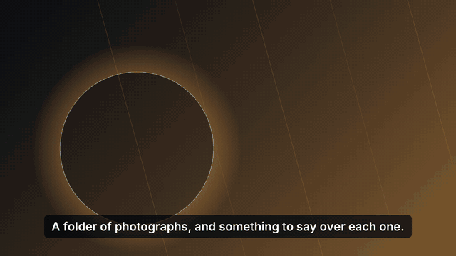

<div align="center">


# spoonstill

**Turn a folder of photos and narration into one finished MP4.**

Ken Burns motion on every still, cut on the narration's own boundaries.
Drop in your files, press Render, walk away.

[](https://github.com/VijaysinghPuwar/spoonstill/actions/workflows/ci.yml)
[](https://github.com/VijaysinghPuwar/spoonstill/releases/latest)
[](#download)

<br>



<sub>Four scenes, 15 seconds, rendered by `still render --subtitles boxed`.
Narration spoken by a neural voice from the text beside each photo; the motion,
the cuts and the captions are all the renderer's. Rebuild it with `make demo`.</sub>

</div>

---

## What it is

You have 40 photos and something to say over each one. spoonstill pairs them up,
gives each still a slow zoom or pan, makes each scene exactly as long as its
narration, and joins the lot into one MP4.

It is **a batch renderer, not a video editor**. There is no timeline and no
scrubber, on purpose. The unit of work is a folder, and the design point is
500 scenes — not five.

Narration can be a recording you made, or a line of text spoken by a neural
voice, or nothing at all (the still just holds). You can mix all three in one
film.

---

## Download

Grab the build for your machine from the
**[latest release](https://github.com/VijaysinghPuwar/spoonstill/releases/latest)**:

| Your machine | Desktop app | Command line |
|---|---|---|
| **macOS** — Apple Silicon *or* Intel | `spoonstill-macOS.dmg` | `still-macOS-AppleSilicon.tar.gz`<br>`still-macOS-Intel.tar.gz` |
| **Windows 10/11, 64-bit** | `spoonstill-Windows-Installer.exe` | `still-Windows.zip` |

The Mac app is one universal build, so you do not have to know which processor
you have. The one-line installer below works that out for the command line too.

> **If you are on Windows, please read this.** Windows is a supported target and
> it is not an afterthought: every push runs the full test suite on a Windows
> runner — formatting, clippy with warnings denied, and `cargo test --workspace`,
> which renders real media through real FFmpeg — and the code is additionally
> cross-compiled for `x86_64-pc-windows-msvc` before a tag is cut (D-132). That
> has already caught four Windows-only defects that reading the code did not.
>
> What has **not** happened is a person sitting at a Windows desktop and running
> the packaged app. `spoonstill-Windows-Installer.exe` and the PowerShell
> one-liner are built and shipped by CI but have never been executed by anyone,
> here or in CI (D-128). The 37 `make gates` checks are macOS-only. Every
> performance number in [`ffmpeg-findings.md`](ffmpeg-findings.md) is macOS
> arm64 and none of it has been measured on Windows.
>
> So: the Windows build is tested, and it is untried. If you are the first
> person to run it, an [issue](https://github.com/VijaysinghPuwar/spoonstill/issues)
> with `still doctor` output is genuinely useful.

### Or install with one line

**macOS**

```bash
curl -fsSL https://raw.githubusercontent.com/VijaysinghPuwar/spoonstill/master/scripts/install.sh | bash
```

**Windows** (PowerShell)

```powershell
irm https://raw.githubusercontent.com/VijaysinghPuwar/spoonstill/master/scripts/install.ps1 | iex
```

Either script installs the `still` command, then checks for FFmpeg and installs
it through Homebrew or winget if it is missing. Nothing runs as administrator
and nothing is written outside your own user folder.

The desktop app can install the voice service for you from **Settings > Voice
service > Install it**; on the command line that is `still voices --install`.

---

## One thing to install first

spoonstill does the thinking; **FFmpeg** does the pixels. It is not bundled yet
(see [D-062](decisions.md#d-062--licensing-boundary) — the shipped binary needs
its own LGPL build first), so it has to be on your machine.

**You do not have to do this by hand.** Open the window, go to
**Settings**, and press **Install it for me** under Video engine — and under
Voice service too, if you want written lines read aloud. Both use the package
manager already on your machine, and both tell you when they are done.

Prefer a terminal? One command checks everything and offers to fetch what is
missing:

```bash
still doctor              # what is here, what is not
still doctor --install    # fetch whatever is missing
```

Or install them yourself, once:

```bash
brew install ffmpeg          # macOS
winget install Gyan.FFmpeg   # Windows

still voices --install       # a neural voice, or: pipx install edge-tts
```

Skip the voice if you are only using recordings you made yourself.

**A note on quality.** Edge TTS is Microsoft's free endpoint and it returns
24 kHz, mono, 48 kbps MP3 — the format is fixed in `edge-tts` itself, because
its word-timing arithmetic divides by exactly that bitrate. spoonstill does not
degrade it further (the working artifact is lossless PCM and the film's audio is
192 kbps AAC), but a free service's ceiling is a free service's ceiling. A
higher-fidelity provider is on the roadmap.

---

## Three minutes to your first film

```bash
# 1. Make a project out of whatever you have. Nothing gets renamed or moved.
still new ~/holiday ~/Pictures/trip/*.jpg ~/Voice\ Memos/*.m4a

# 2. See what it made of them, before anything is encoded.
still validate ~/holiday

# 3. Render.
still render ~/holiday --out ~/holiday.mp4
```

`still new` copies your photos in as `001`, `002`, … in natural order and pairs
each one with a recording — **by matching name first, then by position**. It
never touches your originals and never overwrites anything.

Prefer the window? Launch **spoonstill** from Applications or the Start menu,
drop the folder on it, and press Render. Every button there is one of the
commands above.

### Speaking text instead of recording it

Put a `.txt` file next to a photo — `002.jpg` and `002.txt` — and its contents
become the narration for that scene.

```bash
still voices en-GB                                  # what's available
still render ~/holiday --out ~/holiday.mp4 --voice en-GB-RyanNeural
```

Spoken lines and your own recordings are levelled to the same loudness, so a
phone recording and a synthetic voice sit together in one film without you
riding a fader.

### Size and shape — 1080p, 2K, 4K, and YouTube Shorts

```bash
still resolutions                                   # every size, in every shape
still render ~/holiday --out ~/holiday.mp4 --resolution 4k
still render ~/holiday --out ~/short.mp4 --aspect shorts --resolution 1080p
```

| | 16:9 | 9:16 | 1:1 |
|---|---|---|---|
| `720p` | 1280x720 | 720x1280 | 720x720 |
| `1080p` *(default)* | 1920x1080 | 1080x1920 | 1080x1080 |
| `1440p` — also `2k` | 2560x1440 | 1440x2560 | 1440x1440 |
| `2160p` — also `4k` | 3840x2160 | 2160x3840 | 2160x2160 |

**A YouTube Short, an Instagram Reel, a TikTok and a Story are all 9:16**, so
`--aspect shorts`, `--aspect reel`, `--aspect tiktok` and `--aspect story` all
mean that frame. You do not have to know the ratio to ask for the thing.

The number is the **short edge**, which is why 4K vertical is 2160x3840 rather
than 3840x2160 — the same "4K" gives you the same detail whichever way up the
film is.

Both flags are an override for one run; they never touch `project.yaml`. To
make it the project's own:

```yaml
aspect: 9:16
resolution: 4k    # or `short_edge: 2160` — two spellings of one setting
```

4K is the ceiling. Past it, the file would have to claim an H.264 level that no
player honours, so it is refused rather than written ([D-114](decisions.md)).

**A bigger frame renders fewer scenes at once, and that is on purpose.** One
scene at 4K needs about 2.6 GB while one at 1080p needs about 0.77 GB, so
spoonstill checks how much memory your machine has and picks a number that fits
— on an 8 GB machine that is four scenes at a time at 1080p and two at 4K. It
tells you when memory rather than your CPU chose the number.

You can override it with `--jobs N`, and spoonstill will do as it is told:

```bash
still render ~/holiday --out ~/holiday.mp4 --resolution 4k --jobs 1
```

If the number you ask for does not fit, it renders anyway and warns you first,
naming one that does. Asking for more than fits is how you freeze a machine, so
if a large render ever locks yours up, `--jobs 1` is the answer
([D-144](decisions.md)).

### Subtitles

Off unless you ask — text burned into the picture cannot be taken out again
without re-rendering.

```bash
still subtitles                                     # six looks, and what each is for
still render ~/holiday --out ~/holiday.mp4 --subtitles boxed
still render ~/holiday --out ~/holiday.mp4 --subtitle-position top
still render ~/holiday --out ~/holiday.mp4 --no-subtitles
```

If your pictures already have words drawn into them — captions in the artwork,
a logo along the bottom — put the subtitles at the **top**. A theme with a
plate behind it (`boxed`, `band`, `card`) also covers that lettering, where
`classic` and `minimal` let it show through between the lines.

A scene gets a caption when it has words. That is the `.txt` it speaks — or,
**if the scene has a recording, a `.txt` next to it is the caption for that
recording**, so your own voiceover can be subtitled without typing anything
twice.

To make it the project's own setting, in `project.yaml`:

```yaml
subtitles:
  enabled: true
  theme: boxed      # classic · boxed · band · card · punch · minimal
  position: bottom  # or top
```

In the window there is a **Subtitles** screen: pick a look and see it drawn on
a real frame before you commit a whole film to it, or pick *No subtitles*.

**Languages.** Write in Latin, Greek, Cyrillic or Devanagari and it is drawn
properly — Hindi included, with its conjuncts and matras, which needs real text
shaping and not one glyph per character. You do not tell it which: the script is
read off your words. Another script — Bengali, Tamil, Arabic, Chinese — still
comes out as empty boxes, and `still validate` says so before you render rather
than after.

The same goes for the voice: **write in Hindi and a Hindi voice reads it**,
unless you named one yourself, in which case yours is used.

The text is drawn by spoonstill itself, not by FFmpeg — so this works on the
plain `ffmpeg` you already installed, with no extra libraries and nothing else
to download.

### When it goes wrong

```bash
still doctor                    # is everything this needs actually installed?
still validate ~/holiday        # every problem in the folder, all at once
still diagnostics export --project ~/holiday --out ~/bundle.txt
```

Start with `doctor`. A folder of good photographs opening as **no scenes**, or a
Voice screen with no voices on it, is almost always one missing program rather
than anything wrong with your files — and `doctor --install` fetches it.

`validate` reports *everything* it can find in one pass rather than stopping at
the first bad row. The diagnostics bundle is one text file, with credentials
redacted, that you can attach to an issue.

**In the window**, you never need any of this: wherever spoonstill notices that
something it needs is missing — the Voice screen, the Render screen, Settings —
it says so in a sentence and puts an **Install it for me** button next to it.
Press it and the screen you are on repairs itself.

---

## "Apple could not verify spoonstill is free of malware"

These builds are **not code-signed yet** — signing certificates are M5 work.
The operating system is telling you it cannot identify the publisher, which is
true, and not that anything is wrong with the file.

**The one-line installer above avoids this entirely.** It verifies the
checksum, installs the app, and clears the quarantine attribute itself, so the
first launch is just the app opening. If you downloaded the `.dmg` through a
browser instead:

- **macOS** — press **Done** on that dialog, never *Move to Trash*. Then either
  **System Settings > Privacy & Security**, scroll down, **Open Anyway** — or,
  once:
  ```bash
  xattr -dr com.apple.quarantine /Applications/spoonstill.app
  ```
  Right-click > Open is the advice everywhere on the internet and **Apple
  removed it in macOS 15**; on 15 or later it does nothing.
- **Windows** — on the SmartScreen dialog, click **More info** > **Run anyway**.

If that trade is not one you want to make, [build from source](#build-from-source)
instead: it is two commands.

---

## Build from source

You need [Rust](https://rustup.rs) (1.94+, pinned by `rust-toolchain.toml`) and
FFmpeg on `PATH`.

```bash
git clone https://github.com/VijaysinghPuwar/spoonstill.git
cd spoonstill

cargo build --release -p spoonstill-cli     # -> target/release/still
cargo run   --release -p spoonstill-desktop # the window
```

Working on it:

```bash
make help       # every entry point
make test       # the whole workspace
make lint       # clippy, warnings denied, plus a format check
make fixtures   # synthesize the test media
make gates      # every milestone's exit gates — the real state of the build
```

`make gates` is the honest answer to "does this work?". It runs 37 checks
across M0, M1 and M2 and prints pass/fail for each.

---

## How a project is laid out

A project is just a folder. Everything in it is optional, including
`project.yaml` — a folder of images is already a valid project.

```
holiday/
├── project.yaml     ← settings. Never scenes. spoonstill never writes to it.
├── scenes.csv       ← optional. When present, it is the complete scene list.
├── img/
│   ├── 001.jpg
│   └── 002.jpg
└── audio/
    ├── 001.m4a      ← paired to 001.jpg by name
    └── 002.txt      ← a line to be spoken over 002.jpg
```

```yaml
# project.yaml
output: film.mp4
aspect: 16:9        # or 9:16 (Shorts, Reels, TikTok), or 1:1
resolution: 1080p   # or 720p · 1440p (2k) · 2160p (4k)
fps: 30
defaults:
  duration: 4.0     # how long an unpaired still holds
subtitles:
  enabled: false    # burned into the picture when true
  theme: classic
```

Full rules: [D-056](decisions.md) for what a project folder is and which file
wins, [D-080](decisions.md) for how media gets in, [D-106](decisions.md) for
subtitles, [D-143](decisions.md) for sizes and shapes.

---

## Where things stand

| | |
|---|---|
| **M0** scaffolding, architecture boundary | complete — 8/8 gates |
| **M1** one scene, end to end | complete — 8/8 gates |
| **M2** whole projects: import, validation, speech, parallel render | complete — 21/21 gates |
| **M3** state database, resumable queue | next |
| **M4** the Tauri window | shell exists, ahead of schedule |
| **M5** signing, notarization, bundled FFmpeg, auto-update | not started |

So: it renders real films today, and the releases here are **unsigned preview
builds** that use the FFmpeg already on your machine. Treat them accordingly.

---

## The documents

This project keeps its reasoning in the repository rather than in anyone's head.

| File | What it is |
|---|---|
| [`decisions.md`](decisions.md) | **Single source of truth.** Every design decision, numbered, with the reasoning that produced it. |
| [`plan.md`](plan.md) | Milestones M0–M5, each with runnable exit gates. |
| [`ffmpeg-findings.md`](ffmpeg-findings.md) | Benchmarks measured on real hardware, with reproduction commands. |
| [`CLAUDE.md`](CLAUDE.md) | Orientation for anyone — or anything — picking the work up cold. |

If you are about to propose a design, read `decisions.md` first. Most of it is
already settled, and the reasoning is written down.

---

## Licence

Not yet chosen **for spoonstill's own code** — see [D-062](decisions.md) for the
licence boundaries that already constrain it. Until then, all rights reserved by
the author. The reference checkouts under `plan/` are **not** part of this
repository.

**Third-party material is a separate question, and it is answered** (D-124).
Three weights of Inter are compiled into the binary to draw subtitles, under the
SIL Open Font License — which asks that each copy carry its notice. Every
release archive contains `THIRD-PARTY-NOTICES.md`, the window bundles it, and
every binary can print it:

```bash
still licences
```
